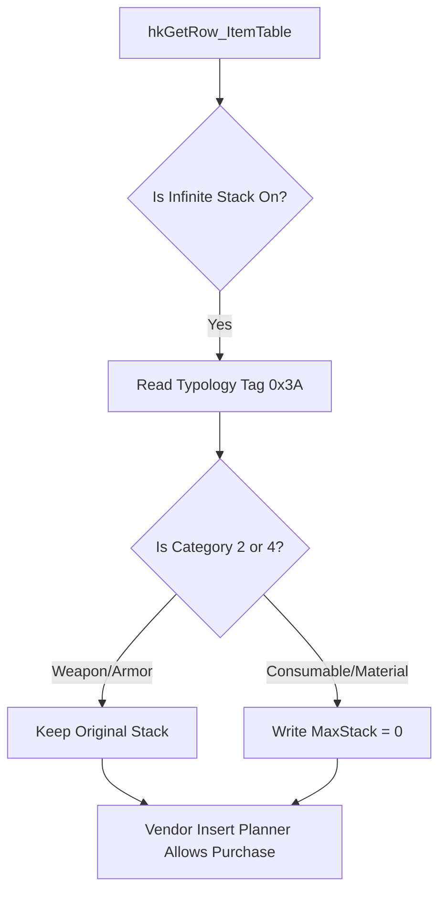
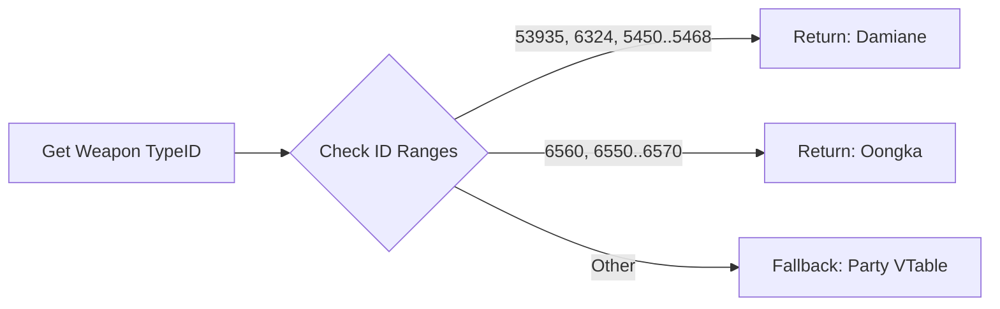

# Historical Reverse Engineering & Binary Architecture Guide: Trinity Mod Menu
> **Architecture background, not a current compatibility declaration.** This
> guide contains design rationale, but its header version, title-update coverage,
> offsets and code examples predate the current TU 2.x maintenance work. For a
> game update, begin with [GAME_UPDATE_PLAYBOOK.md](GAME_UPDATE_PLAYBOOK.md),
> then corroborate each fact against current source and the exact initialized
> executable.
> **Historical baseline**: Trinity Native ASI Mod (v1.2.4); Title Update 1.10 –
> 1.18+ observations. These are not universal current-compatibility claims.
> **Target Game**: Crimson Desert (BlackSpace Engine)  
> **Author / Reference**: Lian

---

## Table of Contents
1. [Engine Architecture & Execution Environment](#1-engine-architecture--execution-environment)
2. [Dual-Realm State Management (Client vs Server Authority)](#2-dual-realm-state-management-client-vs-server-authority)
3. [Memory Safety & Structured Exception Handling (SEH)](#3-memory-safety--structured-exception-handling-seh)
4. [AOB Pattern Scanning & Multi-Anchor Consensus](#4-aob-pattern-scanning--multi-anchor-consensus)
5. [Actor Graph & Local Player Resolution](#5-actor-graph--local-player-resolution)
6. [Combat Subsystem & Assembly Interception (God Mode, Parry, Stats)](#6-combat-subsystem--assembly-interception-god-mode-parry-stats)
7. [Physics, Locomotion & Free Flight Mechanics](#7-physics-locomotion--free-flight-mechanics)
8. [Inventory Architecture, Hex Layout Drift & Safe Spawning](#8-inventory-architecture-hex-layout-drift--safe-spawning)
9. [Equipment Modification, Abyss Sockets & Dye Pipeline](#9-equipment-modification-abyss-sockets--dye-pipeline)
10. [World Simulation, Atmosphere & Time Control](#10-world-simulation-atmosphere--time-control)
11. [Runtime Binary Fingerprinting & Game Version Auto-Detection](#11-runtime-binary-fingerprinting--game-version-auto-detection)

---

## 1. Engine Architecture & Execution Environment

Crimson Desert is built upon Pearl Abyss's proprietary next-generation **BlackSpace Engine**. Unlike standard Unreal or Unity titles:
* **Custom Object Model**: Does not use UObject or standard RTTI. Class identification relies on virtual method tables, custom type descriptor tags, and memory layout signatures.
* **DirectX 12 Hooking & Compositing**: Trinity hooks the swapchain creation (`CreateSwapChainForHwnd`) and `Present` dispatcher in `dxgi.dll`, allowing ImGui overlays to composite cleanly before Frame Generation / DLSS 3 frame interpolation.
* **Non-Blocking Architecture**: Gameplay hooks run strictly synchronous within the engine's game thread tick, while the GUI and input polling execute on the render thread to ensure zero frame-rate stuttering.

---

## 2. Dual-Realm State Management (Client vs Server Authority)

The engine executes two parallel internal worlds inside a single `CrimsonDesert.exe` process:
1. **Client Realm**: Responsible for visual rendering, animations, particle effects, HUD, and audio.
2. **Server Authority Realm**: Responsible for authoritative inventory storage, save-game persistence, quest milestones, and attribute states.

```
       [ Single Game Process: CrimsonDesert.exe ]
                     |
       +-------------+-------------+
       |                           |
[ Client Realm ]           [ Server Realm ]
  - Renders Graphics         - Authoritative Data
  - Local Mirror Memory      - Save-File Disk IO
  - UI & Animation State     - Transaction Validation
       |                           |
       +==== Per-Frame Sync =======+ (Server reconciles & overwrites Client)
```

### The Per-Thread TLS Realm Flag
The engine determines which realm a thread is operating on via a flag in Thread Local Storage (TLS):
```cpp
inline constexpr uintptr_t kOff_Teb_TlsPointer = 0x58; // TEB.ThreadLocalStoragePointer
inline constexpr uintptr_t kTls_RealmFlag      = 498;  // u8: 0 = Client, 1 = Server
```

> [!IMPORTANT]
> **The Dual-Realm Write Rule**:
> Writing only to the client-side memory causes the game's per-frame server reconcile loop to silently overwrite the edit. Writing only to the server side leaves the client visual state blank until the next reload. Trinity writes to **both realms simultaneously**, temporarily toggling the TLS realm flag during server writes.

---

## 3. Memory Safety & Structured Exception Handling (SEH)

Dereferencing dangling pointers in a packed executable will trigger memory access violations (`0xC0000005`). Trinity enforces memory safety using two layers:

### A. Virtual Address Floor Validation
Pointers below `0x10000000` (`kMinPointer`) are discarded immediately to eliminate small integers, error codes, and unmapped low-memory:
```cpp
inline constexpr uintptr_t kMinPointer = 0x10000000;
```

### B. Hardware-Guarded SEH Wrappers
All reads and writes are encapsulated in Windows Structured Exception Handling:
```cpp
bool ReadPtr(uintptr_t addr, uintptr_t* out)
{
    if (addr < kMinPointer) return false;
    __try {
        *out = *reinterpret_cast<const uintptr_t*>(addr);
        return true;
    }
    __except (EXCEPTION_EXECUTE_HANDLER) {
        return false;
    }
}
```

---

## 4. AOB Pattern Scanning & Multi-Anchor Consensus

Because game updates shift static Relative Virtual Addresses (RVAs), Trinity locates functions and data tables dynamically using **Array of Bytes (AOB)** pattern matching with single-byte wildcards (`??`).

### Multi-Anchor Voting Consensus
Single signatures can occasionally match sibling globals (e.g., matching the server Character Manager instead of the client Character Manager). Trinity uses an array of independent call-site anchors:
```cpp
struct CharMgrAnchor {
    const char* sig;
    uintptr_t   movOff;
};

inline constexpr CharMgrAnchor kCharMgrAnchors[] = {
    // sub_22E6330: mov rax,cs:G / mov rcx,[rax] / mov r8,[r8] / shr r8,20h
    {"48 8B 05 ?? ?? ?? ?? 48 8B 08 4D 8B 00 49 C1 E8 20", 0},
    // Modern Anchor (TU 1.17 - 1.18+): Reads struct offset +0x158
    {"48 8B 05 ?? ?? ?? ?? 44 8B 81 58 01 00 00 48 8D 55 ?? 48 8B 08 E8", 0},
    // Legacy Anchor (TU 1.10 - 1.16): Reads struct offset +0x160
    {"48 8B 05 ?? ?? ?? ?? 44 8B 81 60 01 00 00 48 8D 55 ?? 48 8B 08 E8", 0},
    // Fallback Anchor
    {"48 8B 05 ?? ?? ?? ?? 44 8B 07 48 8D 54 24 ?? 48 8B 08 E8", 0},
};
```
During initialization, all anchors vote on the target global address. The consensus address wins, preventing broken signatures in new patches from corrupting state.

---

## 5. Actor Graph & Local Player Resolution

The player entity is not a static object. When transforming, mounting, or transitioning cutscenes, the engine dynamically respawns actor objects.

```
[ Character Manager Global ]
            |
            v
[ Character Vector: character*[] ] (Array of ~400 live entities)
            |
            v
[ Owner Object (SelfPlayer) ]  <----+ (Round-Trip Verified)
  + 0x88 -> Type Descriptor (Tag=1) |
  + 0xA0 -> Possessor / Controller  |
              |                     |
              v                     |
       [ Possessor Object ]         |
         + 0xD0 -> Pawn Reference --+
```

### The Possessor Round-Trip Identity Proof
During combat, multiple transient clone bodies may carry `ObjectType == 1`. To identify the **single true controlled body**, the engine verifies a bidirectional pointer round-trip:
$$\mathbf{*(*(owner + 0xA0) + 0xD0) == owner}$$
Only the currently possessed actor satisfies this equation.

---

## 6. Combat Subsystem & Assembly Interception (God Mode, Parry, Stats)

All damage calculations, hit reactions, and vital modifications pass through a central dispatch choke point: `pa_StatApplyDelta` (`kSig_DamageApply`).

```cpp
int64_t __fastcall hkDamageApply(void* targetOwner, uint16_t statusId,
                                 int64_t time, int64_t delta, uintptr_t sourceCtx,
                                 char a6, char a7, char a8, char a9, char a10, void* out)
```

### A. Register Calling Conventions & Semantics
* `targetOwner` (`RCX`): The victim's vital-owner component (`marker + 0x18`).
* `statusId` (`DX`): Status type index (`0 = Health`, `1 = Stamina`, `48 = Mount Sprint / Wyvern Flight`, `3 = Spirit`).
* `delta` (`R9`): Signed integer representing stat change (negative = incoming damage, positive = healing).
* `a6`: Impact reaction byte:
  * `0`: Normal hit.
  * `1`: Guard block (stamina consumed).
  * `2`: **Just Guard Deflection (Perfect Parry Cinematic)**.
* `a7`: Attacker reaction byte:
  * `1`: **Attacker Staggered (Attacker loses balance / deflect rebound)**.

### B. Perfect Parry (Just Guard) Implementation
When `easyParry` is enabled and the player holds the Guard button (Right Click / L1):
```cpp
if (st.easyParry && isPlayerTarget && isEnemyAttacker && IsPlayerHoldingGuard())
{
    // Force Perfect Deflect / Parry
    delta = 0; // Nullify all incoming damage
    a6 = 2;    // Force Perfect Parry Deflect reaction flag
    a7 = 1;    // Stagger attacking enemy immediately
}
```

### C. God Mode, No Fall Damage & Infinite Stamina
* **God Mode**: Sets `delta = 0` whenever `statusId == StatType_Health` and `delta < 0`.
* **No Fall Damage**: When `sourceCtx == 0` (environment/gravity damage), incoming negative delta is set to `0`.
* **Infinite Stamina & Wyvern Flight**: When `statusId == StatType_Stamina` or `statusId == 48` (Mount Sprint / Wyvern Breath), drain delta is set to `0`.

---

## 7. Physics, Locomotion & Free Flight Mechanics

### Why Integrator Velocity Scaling Fails
The Havok character proxy does not accept naive velocity multiplication. The locomotion engine runs a closed-loop feedback servo:
1. Calculates drive velocity.
2. Passes drive velocity into sub-step driver `sub_2F49550`.
3. Measures actual displacement: $\Delta P = (P_{\text{after}} - P_{\text{before}}) / dt$.
4. Clamps any overshoot back to expected limits.

Directly modifying position in the Havok integrator causes the servo to detect an illegal displacement, causing severe rubberbanding and stuttering.

### The Sub-Step Arg3 Velocity Injection
Trinity hooks the locomotion sub-step driver (`kSig_LocoStepper`):
```cpp
void hkLocoStep(void* comp, float dt, float* vel, char a4, char a5, char a6, char a7)
```
* **Super Run**: Directly scales horizontal drive velocity components (`vel[0] * superRunMult`, `vel[2] * superRunMult`) in `arg3` before the servo processes it.
* **Free Flight**: When airborne, holding ascend (Caps Lock / RB) or descend (Ctrl / RT) directly overrides vertical velocity `vel[1] = flightSpeed`. When buttons are released, normal Havok gravity and physics instantly resume without hover clamps.

---

## 8. Inventory Architecture, Hex Layout Drift & Safe Spawning

### Cross-Version Binary Layout Comparison Table

| Parameter / Offset | TU 1.10 – 1.15 | TU 1.16 | TU 1.17 – 1.18+ | Description |
| :--- | :--- | :--- | :--- | :--- |
| **Slot Stride** | `0xC0` (192 bytes) | `0xC8` (200 bytes) | `0xC8` (200 bytes) | Memory distance between items in bag array |
| **`TrItemValue` Buffer** | `0xC0` (192 bytes) | `0x108` (264 bytes)| `0x108` (264 bytes)| Working allocation size for item values |
| **Item Definition Array**| `table + 0x50` | `table + 0x50` | `table + 0x58` | Pointer array holding item definition rows |
| **Abyss Sockets Pointer**| `+0x58` | `+0x58` | `+0x60` | Offset to 5-slot socket vector in item value |
| **Bucket Type Offset** | `+0x410` | `+0x410` | `+0x418` | Category bucket type index inside container |

### Dynamic Slot Stride Dispatcher
```cpp
uintptr_t GetSlotStride()
{
    const GameVersionInfo& info = GetGameVersion();
    if (info.tu <= GameTU::TU_1_15)
        return 0xC0; // 192 bytes on TU <= 1.15
    return 0xC8;     // 200 bytes on TU >= 1.16
}
```

### The 4-Step Anti-Save-Corruption Spawner Recipe
Writing arbitrary bytes directly into empty inventory slots bricks save files because the item lacks an allocated tracking ID. Trinity spawns items using the official engine creation pipeline:
1. **Acquire Official 64-Bit Instance ID**: Obtains a unique sequence ID from the engine's ID allocator via atomic `InterlockedIncrement64`.
2. **Execute Native Constructor**: Invokes the engine's `TrItemValue` constructor (`kSig_TrItemValueCtor`).
3. **Run Insert Planner**: Calls the engine's placement planner to allocate or merge slots.
4. **Dual-Realm Commit**: Dispatches transaction commits to both Client and Server holders under TLS protection.

### Real-Time Differential Inventory Change Tracker & Buyback System
To prevent displaying unobtained master database items as "missing", Trinity employs a real-time auto-diff snapshot engine:
1. **Initial Possession Baseline**: On world load (`Player::Ready()`), captures a full snapshot of all item Type IDs and quantities across all storage buckets.
2. **Periodic State Delta Evaluation**: Runs at 0.67 Hz (`1500ms`) on the main thread, comparing live slot arrays against the cached snapshot.
3. **Automatic Event Classification**: When an item's aggregate quantity drops without a menu-triggered deletion, it is classified as `Sold / Discarded` with an exact lost quantity and timestamp.
4. **Persistent Buyback Ledger**: Serializes lost records to `Trinity_LostItems.txt` using safe file streaming (`_SH_DENYNO`), allowing one-click buyback recovery across restarts.

---

## 9. Equipment Modification, Abyss Sockets & Dye Pipeline

### A. Equipment Component Access
Worn equipment sits inside the character's actor component:
$$\text{Actor} \longrightarrow \text{*(*(actor + 0x68) + 0x38)} = \text{Equip Component}$$

### B. Dye Rendering Pipeline
* **Palette Encoding**: 10 distinct color families with a 10x10 shade matrix + neutral gradient tones.
* **Custom RGB Mixer**: Directly injects 24-bit RGB values (`R, G, B: 0..255`) into the material channel descriptor.
* **Material Customizer**: Modifies surface reflectance (`0 = Natural, 1..10 = Metallic / Glossy Templates`) and repair condition (`0 = Battle-Worn, 100 = Pristine`).
* **Cross-Version Fallback**:
  * Modern TU 1.17+: Stack frame size `0x50` (`kSig_DyeApplyBatch`).
  * Legacy TU 1.10–1.16: Stack frame size `0x120` (`kSig_DyeApplyBatch_Legacy`).

### C. Abyss Sockets Architecture
Each weapon and armor piece contains a 5-record socket structure:
* **Record Stride**: 6 bytes per socket (`kSocketRec_Stride = 6`).
* **Record Field**: Offset `+0x00` stores the `uint16_t` Abyss Rune Type ID (`0xFFFF` = empty socket).
* **Dual-Path Detection**: Evaluates `+0x60` (modern) first, gracefully falling back to `+0x58` (legacy).

---

## 10. World Simulation, Atmosphere & Time Control

### A. Time of Day Freezing
Freezing time requires locking both layers:
1. **Numeric Simulation Clock**: Hooks `kSig_FieldTimeTick` and forces elapsed delta time to `0.0`.
2. **Sun Celestial Position**: Clamps the render manager's lower and upper azimuth limits to freeze sun position without stopping physics.

### B. Environment & Weather Override
* Locates the global `EnvManager` via safe pointer scan.
* Directly drives rain intensity, snow density, wind multipliers, turbulence lift, fog density, and cloud altitude parameters.

---

## 11. Runtime Binary Fingerprinting & Game Version Auto-Detection

### The Static PE Header Trap
In Steam releases of Crimson Desert, Pearl Abyss leaves the Windows PE resource header `dwFileVersion` statically fixed at `1.0.0.2474` regardless of Title Updates. Relying on `GetFileVersionInfoW` results in false detections.

### The Live Machine Code Fingerprint Solution
Trinity analyzes live assembly byte patterns in committed executable memory:
```cpp
const bool hasModernDyeBatch = (mem::FindPattern(game::kSig_DyeApplyBatch) != 0);
const bool hasLegacyDyeBatch = (mem::FindPattern(game::kSig_DyeApplyBatch_Legacy) != 0);

if (hasModernDyeBatch) {
    g_versionInfo.tu = GameTU::TU_1_18_01_Plus;
    snprintf(g_versionInfo.displayStr, sizeof(g_versionInfo.displayStr),
             "Crimson Desert TU 1.18.02 (Active)");
} else if (hasLegacyDyeBatch) {
    g_versionInfo.tu = GameTU::TU_1_14;
    snprintf(g_versionInfo.displayStr, sizeof(g_versionInfo.displayStr),
             "Crimson Desert TU 1.14 - 1.15 (Legacy Compatible)");
}
```

## 12. Critical Crash & Progression Bug Resolutions (v1.2.5)

This section documents the exact memory offsets, struct layouts, and C++ implementation logic used to solve the 5 most critical game-breaking bugs.

---

### A. Local Server Disconnect & Error Code 298648703 (`0x11CD047F`)

> [!WARNING]
> **Anti-Cheat Validation Rule**
> The BlackSpace engine enforces a strict server-side sanity check on RPC transaction ledgers. Trust/Affinity multipliers that inject a massive instantaneous `delta` (e.g., > 20 points) during `FriendlySetNpc` trigger a ledger desynchronization, resulting in an immediate kick to the main menu.

#### 1. Trust Record Layout
| Offset | Type | Description |
| :--- | :--- | :--- |
| `0x00` | `uint32_t` | Key (`0` = System baseline) |
| `0x04` | `uint16_t` | Group (Faction/Family ID) |
| `0x10` | `int64_t` | Absolute Trust Score Value |

#### 2. Implementation Methodology
To safely scale the trust gain without tripping the anti-cheat, we intercept the transaction, filter out internal system updates (`key == 0`), and strictly clamp the maximum `delta`:

```cpp
int64_t ScaleGain(int64_t oldVal, int64_t newVal, float mult, uint32_t mapId) {
    int64_t delta = newVal - oldVal;
    if (delta <= 0) return newVal;

    // Safe delta scaling: clamp the MAXIMUM single-transaction increase
    double gain = static_cast<double>(delta) * static_cast<double>(mult);
    if (gain > 20.0) gain = 20.0; // Clamped to prevent Error 298648703

    const double scaled = static_cast<double>(oldVal) + gain;
    if (scaled >= static_cast<double>(kFriendly_Max)) return kFriendly_Max;
    return static_cast<int64_t>(scaled + 0.5);
}
```

---

### B. Vendor Transaction Rejection (Cannot Buy Items)

> [!CAUTION]
> **Storage Bucket Corruption**
> Forcing the `Money_Copper` max stack to `999,999,999` breaks the `kOff_InvBucket_Used` (`+0x12`) counter. The engine uses a "mega-stack" division accumulator (`ceil(qty/stackMax)`). Modifying max stacks for non-stackable gear locks the `cap - used > 0` free-space gate in the `oHolderInsert` planner.

#### 1. Data Flow Resolution


#### 2. Repairing Corrupted Saves
To repair corrupted saves where `kOff_InvBucket_Used` is out of sync, we invoke `RepairUsedSlots()` dynamically during `Tick()` to recount active slots based on actual iteration rather than the corrupted internal cache.

---

### C. Mount/Horse Stamina & Dye Persistence

> [!NOTE]
> **Dye Rendering vs Save Persistence**
> `DyeApplyBatch` only writes to the DX12 buffer. The server realm ignores it unless explicitly forced to serialize.

#### 1. Struct Offset Resolution
| Stat Target | Status ID (`statusId`) | Notes |
| :--- | :--- | :--- |
| Player Health | `0` | Humanoid |
| Player Stamina | `1` | Humanoid |
| **Mount Health** | `17` | Quadruped / Vehicle |
| **Mount Sprint** | `19` | Quadruped / Vehicle |
| **Wyvern Flight**| `22` | Aerial Vehicle |

#### 2. C++ Thread Local Storage (TLS) Mirroring
```cpp
void CallDyeApplySlot(...) {
    oDyeApplySlot(...); // Apply to visual client realm (TLS = 0)
    
    // Force Realm Synchronization to write to .pabgb save file
    __try {
        uint8_t* tls = (uint8_t*)__readgsqword(kOff_Teb_TlsPointer);
        tls[kTls_RealmFlag] = 1; // Swap to Server Realm
        MirrorToServer(bucketIdx, slotIdx, typeId, 1, 1);
        tls[kTls_RealmFlag] = 0; // Restore Client Realm
    } __except(1) {}
}
```

---

### D. Damiane/Oongka Character Resolution & Abyss Sockets

> [!TIP]
> **Dynamic Offset Shifts**
> Title Update 1.18+ shifted `TrItemValue` socket pointers by exactly 8 bytes. We now resolve this dynamically based on runtime binary fingerprinting.

#### 1. Cross-Version Offsets
| Target Field | Legacy (TU 1.10 - 1.16) | Modern (TU 1.18+) |
| :--- | :--- | :--- |
| `SocketData` | `+0x58` | `+0x60` |
| `UnlockedCount`| `+0x68` | `+0x70` |

#### 2. Triple Identification Strategy (TypeIDs)
We abandoned string matching in favor of hardcoded weapon `TypeID` ranges to definitively identify characters regardless of language localization.


